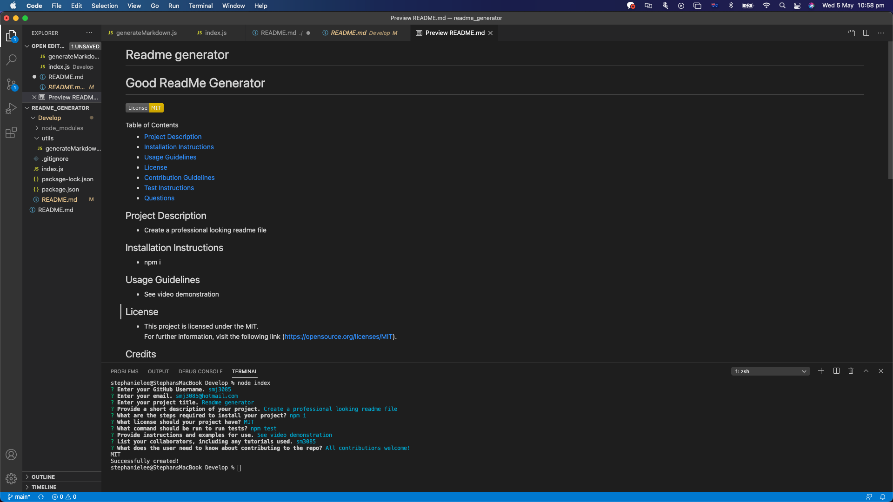

# Readme Generator using Node.js

## Table of Contents
* Description
* Installation
* GitHub Repository URL 
* Screenshot
* Video demonstration 
* Questions

## Description 
A node.js application that creates a quality README.md file from user input via inquirer. 
The user will be prompted to answer a series of questions regarding the app. Then a README.md file will be automatically generated.

## Installation
npm i
node index.js

## GitHub Repository URL
https://smj3085.github.io/readme_generator/

## Screenshot

## Video demonstration
See link for demo: https://drive.google.com/file/d/1w6hNg3JpVHy4CIFtZ4_TiT_RllZfajb0/view

## Questions
  If you have any questions about the repo, email me on stephaniemjlee@gmail.com.  
  You can find more of my work at http://github.com/smj3085
